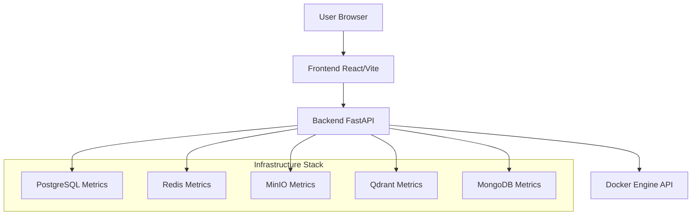

# Infra Manager

A centralized infrastructure management and monitoring dashboard.

## Overview

Infra Manager provides a unified "Command Center" for shared infrastructure services (Postgres, Redis, MinIO, Qdrant, MongoDB). It solves the problem of redundant service instances across multiple applications, simplifying port management and reducing system resource consumption.

### Key Features

- **Centralized Dashboard**: A premium React interface for real-time monitoring.
- **Service Monitoring**: Displays health and status of Docker containers using the Docker API.
- **Detailed Insights**: View live metrics like Redis keys, Postgres databases/tables, MinIO buckets, Qdrant collections, and MongoDB databases/collections.
- **Connection Info**: Quick-copy connection strings for each service.
- **Quick Access**: Direct links to service consoles (e.g., MinIO Console, Qdrant Dashboard).
- **Resource Efficient**: Consolidates multiple service instances into a single shared stack.

## Service Ports

| Service   | Host      | Port(s)      | Purpose           |
|-----------|-----------|--------------|-------------------|
| Postgres  | localhost | 54321        | SQL Database      |
| Redis     | localhost | 63791        | Cache/Store       |
| MinIO     | localhost | 9000, 9001   | Object Storage    |
| Qdrant    | localhost | 6333, 6334   | Vector Database   |
| MongoDB   | localhost | 27018        | Document Database |
| Backend   | localhost | 8000         | API Server        |
| Frontend  | localhost | 5173         | Dashboard UI      |

## Architecture

The project consists of three main components:

1.  **Shared Infrastructure**: Defined in `docker-compose.yml`, managing Postgres, Redis, MinIO, Qdrant, and MongoDB containers.
2.  **Backend (FastAPI)**: A Python service that interacts with the Docker SDK to fetch container statuses and queries individual services for metrics.
3.  **Frontend (React + Vite)**: A modern, responsive dashboard built with Shadcn UI and Lucide icons.



## Getting Started

### Prerequisites

- [Docker](https://www.docker.com/) and [Docker Compose](https://docs.docker.com/compose/)
- [uv](https://github.com/astral-sh/uv) (for Python package management)
- [pnpm](https://pnpm.io/) (for frontend package management)

### Quick Start

The project includes a `Makefile` to streamline development:

1.  **Launch all services** (Docker, Backend, and Frontend):
    ```bash
    make up
    ```
    This will start services in the background. Logs will be saved to the `logs/` directory at the root.

2.  **View Logs**:
    - Backend: `tail -f logs/backend.log` (or `make tail-backend`)
    - Frontend: `tail -f logs/frontend.log` (or `make tail-frontend`)

3.  **Stop Apps only**:
    ```bash
    make kill
    ```

4.  **Stop everything** (including Docker):
    ```bash
    make down
    ```

### Manual Installation

#### Backend
```bash
cd backend
uv sync
uv run main:app
```

#### Frontend
```bash
cd frontend
pnpm install
pnpm dev
```

## Project Structure

```text
.
├── backend/                # FastAPI application
│   ├── routers/           # API routes (health, services)
│   ├── services/          # Business logic for each service
│   ├── config.py          # Centralized configuration
│   ├── main.py            # App initialization
│   └── pyproject.toml     # Python dependencies (uv)
├── frontend/               # React application
│   ├── src/
│   │   ├── components/    # UI components (ServiceCard, AlertDialog)
│   │   ├── hooks/         # Custom hooks (useServices)
│   │   └── App.tsx        # Main dashboard layout
│   └── pnpm-lock.yaml     # Frontend dependencies
├── docker-compose.yml      # Infrastructure service definitions
├── Makefile                # Development shortcuts
└── INFRA_MANAGER.md        # Original problem statement and vision
```

## Destructive Operations

The dashboard now includes the ability to drop databases and buckets for the following services:

- **PostgreSQL**: Drop any non-system database.
- **MinIO**: Drop any bucket (will automatically clear all objects first).
- **MongoDB**: Drop any non-system database.

> [!CAUTION]
> These actions are permanent and cannot be undone. Always verify you are on the correct environment before performing a drop operation. System databases (e.g., `postgres`, `admin`, `config`) are protected and cannot be dropped through the interface.

## Development

The frontend is configured with `verbatimModuleSyntax: true` in TypeScript, meaning interfaces must be imported using `import type`.

Example:
```typescript
import type { Service } from "@/hooks/use-services";
```

## License

MIT
